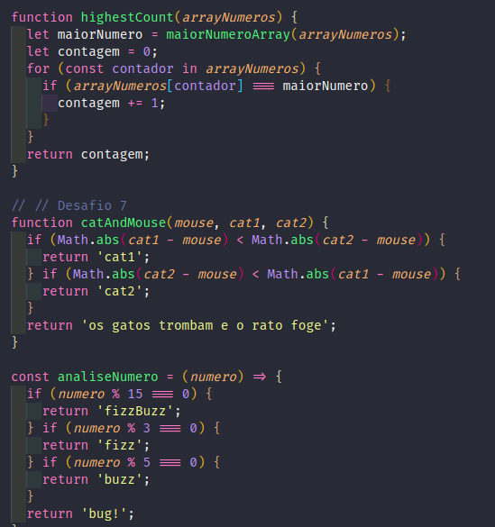

# Projeto Playground Functions

> Módulo de Fundamentos

 Site desenvolvido como projeto da Trybe em 2022

## Tecnologias

- JavaScript
- Git e Github

## Contato
https://www.linkedin.com/in/gregoriobezerra/

gregoriodmhbezerra@gmail.com

## Observações
Apenas o conteúdo da pasta src e github foi de minha autoria, os demais arquivos são de autoria da Trybe.
